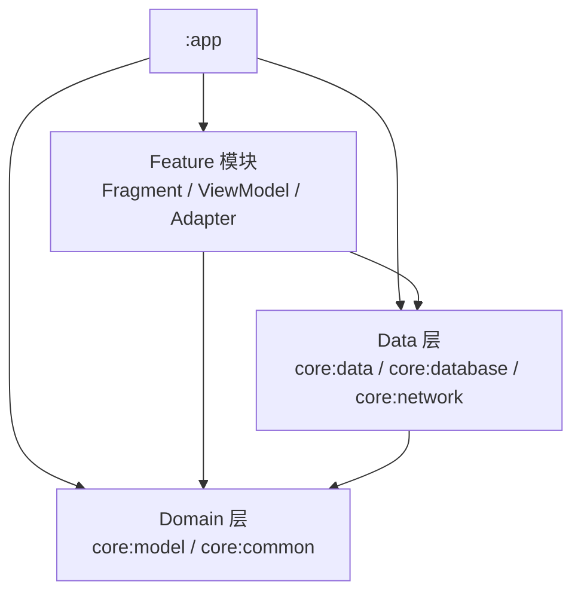

# 🧠 MnemoAI — AI 智能单词记忆助手

> 一款结合 **AI 智能释义** 与 **科学间隔重复算法** 的 Android 背单词应用。
> 让每个单词不再只是"背下来"，而是**理解它、记住它、忘不掉它**。

MnemoAI 以「核心意象 + 构词拆解」的 AI 助记为核心亮点，配合自定义的间隔重复（Spaced Repetition）复习算法，帮助用户在最佳遗忘节点巩固单词。应用采用 **Clean Architecture + 多模块化** 架构，离线优先，所有数据本地存储。

---

## 📖 目录

- [✨ 功能特性](#-功能特性)
- [🏗️ 架构设计](#️-架构设计)
- [🗄️ 数据层设计](#️-数据层设计)
- [🧮 记忆算法（间隔重复）](#-记忆算法间隔重复)
- [🤖 AI 智能释义服务](#-ai-智能释义服务)
- [📦 功能模块详解](#-功能模块详解)
- [🚀 快速开始](#-快速开始)
- [📁 项目结构](#-项目结构)
- [🗺️ Roadmap](#️-roadmap)
- [📄 License](#-license)

---

## ✨ 功能特性

### 🧠 AI 智能助记

接入 **DeepSeek API**，为每个单词一键生成结构化助记信息，并**本地缓存**（生成一次，永久复用）：

- **核心意象**：用一句有画面感的中文解释单词含义，避免抽象（如 "跑" 优于 "移动"）
- **词根词缀拆解**：前缀 / 词根 / 后缀 的形态与含义（如 `de-` 向下 + `riv` 河流 + `-e` 动词后缀 → derive）
- **英文例句**：2～3 个常用例句，自动高亮句中该单词及其词形变化
- **短语搭配**：0～5 个常见短语/固定搭配

未配置 API Key 时，应用其余功能可完全正常使用。

### ⏰ 间隔重复记忆

内置自定义记忆算法（`MemoryAlgorithm`），根据单词的**熟悉程度**动态计算下一次复习时间：

- 基础复习间隔：`1 → 2 → 4 → 7 → 14 → 21 → 30` 天
- 结合每次学习时的「模糊次数 / 忘记次数 / 学习耗时」评估困难度，动态缩短或保持间隔
- 复习间隔限制在 `1 ~ 180` 天之间，防止过于密集或过于松散

### 📅 每日学习计划

- 每日自动编排学习队列：**新学单词 + 今日到期复习单词**
- 新学单词数可在「单词本」页自定义（默认 20 词/天）
- 按「认识 / 模糊 / 忘了」三档反馈动态重排队列，忘记的词会排得更近、反复出现

### 📚 自定义单词本

- 自由创建 / 修改 / 删除单词本（如「雅思词汇」「四级词汇」「工作术语」）
- 选择单词本**加入学习**或**取消学习**
- 在单词本内按搜索**添加 / 移除单词**（前缀匹配，实时预览）
- 单词本详情页展示：总词汇、待学习、复习中、已掌握数量

### 🔍 单词搜索

全局搜索单词（前缀匹配），点击直达单词详情页。

### 📊 学习统计

- 「统计」页基于 **MPAndroidChart** 展示学习趋势：
  - 堆叠柱状图：每日新学 / 复习数量
  - 折线图：每日学习时长（自动格式化为 时/分/秒）
- 单词详情页展示该单词的历史学习记录（认识/模糊/忘记次数、学习时长）

### 🌗 主题切换

「我的」页支持 **跟随系统 / 日间 / 夜间** 三种模式，启动时自动应用，全量适配 Material Design 3 动态配色。

### 📴 离线优先

- 内置 **ECDICT 开源词库**（约 77 万词条，首次启动自动装载）
- 所有学习数据（计划、复习、统计、AI 助记缓存）均存于本地 Room 数据库
- 仅「AI 智能助记」需要网络，其余功能完全离线可用

---

## 🏗️ 架构设计

项目参考 [Now in Android](https://github.com/android/nowinandroid) 的分层思路，采用 **Clean Architecture + 多模块化**，严格遵循**单向依赖**规则：

```
app → feature → core:data → core:database / core:network
                 ↓
              core:model / core:common
```

### 分层架构图



### 模块结构

```
MnemoAI/
├── app/                            # 应用入口：MainActivity / 导航图 / 主题
├── shared-ui/                      # 跨 feature 共享的 UI 组件（对话框等）
├── core/
│   ├── model/                      # 纯 Kotlin Domain Model + Repository 接口
│   ├── common/                     # LoadingState / Dispatcher / MemoryAlgorithm / 工具类
│   ├── database/                   # Room Entity / DAO / Converters / 内置词库装载
│   ├── network/                    # Retrofit / DeepSeek 数据源 / Prompt
│   ├── data/                       # Repository 实现 / Entity ↔ Domain Mapper
│   ├── datastore/                  # 偏好存储（预留模块）
│   └── ui/                         # 共享 Adapter / 自定义 View / 工具类
└── feature/
    ├── reciteword/                 # 背单词核心流程
    ├── vocabularybook/             # 单词本列表 / 学习状态
    ├── vocabularybookgroup/        # 单词本分组详情
    ├── changevocabularybookword/   # 调整单词本内容（增删单词）
    ├── search/                     # 单词搜索
    ├── worddetail/                 # 单词详情页
    ├── statistic/                  # 学习统计图表
    └── mine/                       # 个人中心 / 设置
```

### 关键设计原则

| 原则 | 说明 |
|------|------|
| **Domain Model 隔离** | `core:model` 为纯 Kotlin 类，零 Android 依赖，Feature 层只引用 Domain Model |
| **Repository 接口/实现分离** | 接口定义在 `core:model`，实现在 `core:data`，通过 `asExternalModel()` 扩展函数转换 |
| **异步统一为 Coroutines** | DAO 返回 `Flow`，Repository 返回 `Flow<Result<T>>` 或 `suspend Result<T>` |
| **单向依赖** | Feature 之间禁止相互依赖，共享组件统一放 `shared-ui` |
| **ViewBinding 分层启用** | 仅 UI 模块（app / core:ui / shared-ui / feature）启用 ViewBinding |
| **网络层可替换** | `AiServiceType` 枚举 + `AiServiceProvider` 隔离具体 AI 服务商 |

> 完整的模块依赖关系图见 [docs/module-dependencies.md](docs/module-dependencies.md)。

---

## 🗄️ 数据层设计

### Room 数据库

数据库名 `VOCABULARY`，10 张表：

| 表 | 用途 | 关键字段 |
|---|---|---|
| `groups` | 单词本 | 名称、描述、创建时间、是否学习中 |
| `words` | 单词 | 拼写、音标、释义、翻译、词性、柯林斯/牛津星级、BNC/FRQ 词频、词形变化、音频 |
| `word_group` | 单词本-单词关联 | group_id ↔ word_id |
| `word_extract` | AI 助记缓存 | word_id（主键）+ JSON 文本（Gson TypeConverter） |
| `word_review` | 复习调度 | 复习次数、下次复习日期、复习状态 |
| `day_plan` | 每日计划 | 日期、学习目标数 |
| `day_plan_word` | 每日计划单词 | type(0 新学/1 复习)、status(0 未完成/1 已完成)、模糊/忘记次数、学习时长、完成时间 |
| `word_pos` / `word_meaning` / `word_form` | 单词详情 | 词性、多义项、词形变化 |

### 内置词库

```kotlin
Room.databaseBuilder(context, AppDatabase::class.java, "VOCABULARY")
    .createFromAsset("vocabulary.db")   // assets 内由脚本生成的预置词库
    .build()
```

首次启动自动将预置词库装载为本地数据库，之后完全离线可用。词库不随仓库分发（约 200MB，GitHub 单文件上限 100MB），由仓库内 `tools/csv_to_sqlite.py` 脚本从 CSV 生成——CSV 可使用仓库自带的 `app/src/main/assets/vocabulary.csv`，或从 [ECDICT](https://github.com/skywind3000/ECDICT) 下载的 `ecdict.csv`。生成步骤见「[快速开始 → 生成内置词库](#生成内置词库首次构建前执行)」。

### 用户偏好

- 位置：`SharedPreferences("user_settings")`（`core:datastore` 为预留模块，当前实现位于 `UserSettingRepositoryImpl`）
- 存储项：每日新学词数（默认 20）、日夜模式、DeepSeek API Key
- 通过 `MutableStateFlow` 包装为响应式 `Flow`，供各页面订阅

### 复习调度

- 每日计划生成：新学词从「学习中单词本」里随机抽取（排除已学/已在计划中的），复习词取 `next_review_time = 今天` 的单词
- 单词被「认识」后：写入 `word_review` 并依据记忆算法计算下一次复习日期
- 统计查询：按日期聚合 `day_plan_word`，生成 `DailyStatistic` / `StudyStatistic`

---

## 🧮 记忆算法（间隔重复）

核心实现：`core/common/src/main/java/com/kite/mnemoai/common/MemoryAlgorithm.java`

### 基础间隔

复习次数对应基础间隔（天）：

```
复习次数  0   1   2   3   4   5   6   7+
间隔(天)  1   2   4   7  14  21  30  30
```

### 困难度评估

每次学习结束时，综合三个维度计算困难度 `difficulty ∈ [0, 1]`：

| 维度 | 权重 | 计分规则 |
|---|---|---|
| 忘记次数 | 0.5 | 1次=0.6 / 2次=0.9 / ≥3次=1.0 |
| 模糊次数 | 0.3 | 1次=0.4 / 2次=0.7 / ≥3次=1.0 |
| 学习耗时 | 0.2 | ≤10s=0 / ≤30s=0.4 / ≤60s=0.7 / >60s=1.0 |

### 间隔调整

```
调整系数 = 1.0 - difficulty × 0.8        // 0.2 ~ 1.0
下次间隔 = 基础间隔 × 调整系数             // 钳制在 [1, 180] 天
```

- 毫无困难（模糊/忘记均为 0）→ 按基础间隔原样推进
- 越困难 → 间隔越短，单词会更快再次出现

### 背诵队列动态重排

在背单词页面，每个词可给出三种反馈（`ReciteWordViewModel`）：

| 反馈 | 行为 | 队列位置 |
|---|---|---|
| 🟢 认识 | 完成该词，写入统计与复习计划 | 移出队列 |
| 🟡 模糊 | 统计模糊次数，重新插入 | 队列 **60% ~ 100%** 区间随机位置 |
| 🔴 忘了 | 统计忘记次数，重新插入 | 队列 **30% ~ 60%** 区间随机位置 |

忘记/模糊的词在当前队列中更早再次出现，形成"当轮巩固 + 跨天复习"双重复习。

---

## 🤖 AI 智能释义服务

核心实现：`core/network`（`WordExtractDeepSeekService` / `WordExtractDeepSeekDataSource`）

### 调用链路

```
Fragment (背诵页 / 单词详情页)
  → AiMnemonicRepository.generateWordExtract(wordDetail, request)
  → AiServiceProvider → WordExtractDataSource (DeepSeek 实现)
  → POST https://api.deepseek.com/chat/completions   (model: deepseek-v4-flash)
  → 解析 JSON → WordExtract → 存入 word_extract 表（本地缓存）
```

### 请求设计

- 接口：DeepSeek `chat/completions`，`Authorization: Bearer <api_key>`
- 模型：`deepseek-v4-flash`（`PromptConstants` 中同时预留了 `deepseek-v4-pro` 常量）
- 响应格式：`response_format = json_object`，强制模型只输出一行有效 JSON
- 可扩展：`isEnableThinking` 控制是否开启深度思考（`thinking.type = enabled/disabled`）

### Prompt 设计

System Prompt 将模型定位为「英语词汇记忆专家」，要求严格按 JSON 输出：

```json
{
  "word": "单词原形",
  "affix": {
    "prefix": {"form": "前缀形", "meaning": "中文含义"} 或 null,
    "root":   {"form": "词根形", "meaning": "中文含义"} 或 null,
    "suffix": {"form": "后缀形", "meaning": "中文含义"} 或 null
  },
  "explain": "一句简洁中文解释，融合意象与构词逻辑",
  "example_sentences": [{"sentence": "英文例句", "translation": "中文翻译"}],
  "phrases": [{"phrase": "英文短语", "meaning": "中文释义"}]
}
```

### 容错与缓存

- API Key 连通性测试：在「我的」页填写 Key 时，自动用 `apple` 发起一次真实请求验证
- 生成结果解析失败（`JsonSyntaxException`）时返回友好错误「接收数据格式错误！」
- 成功的助记结果持久化到 `word_extract` 表，后续进入背诵页/详情页直接读取，不再重复请求

---

## 📦 功能模块详解

### 底部导航（app）

| Tab | 入口 Fragment | 说明 |
|---|---|---|
| 背单词 | `ReciteWordFragment` | 每日学习主流程 |
| 单词本 | `VocabularyFragment` | 词书管理与每日进度 |
| 统计 | `StatisticFragment` | 学习趋势图表 |
| 我的 | `MineFragment` | API Key / 主题设置 |

| Feature 模块 | 职责 | 主要界面 |
|---|---|---|
| `reciteword` | 背诵流程：三态反馈、队列重排、AI 助记、学习历史 | 单词卡片（ViewFlipper 切换）、进度条、AI 横幅 |
| `vocabularybook` | 当前学习词书、全部词书、每日新学数设置、加入学习 | 双列表 + 每日统计头部 |
| `vocabularybookgroup` | 词书详情：单词列表、修改/删除词书、学习状态 | 词书详情页 |
| `changevocabularybookword` | 按搜索增删词书内单词（添加/移除两种模式） | 增删单词页 |
| `search` | 全局前缀搜索单词 | 搜索页 |
| `worddetail` | 单词详情：释义、词形、AI 助记（加载/成功/失败三态）、学习历史 | 详情页 |
| `statistic` | 学习统计（MPAndroidChart 组合图） | 统计页 |
| `mine` | API Key 设置与测试、日夜模式切换 | 我的页 + 对话框 |

### 模块依赖一览

| Feature 模块 | core:model | core:data | core:database | core:ui | core:common | 依赖其他 feature |
|---|:---:|:---:|:---:|:---:|:---:|:---:|
| search | ✓ | ✓ | - | ✓ | ✓ | - |
| mine | ✓ | ✓ | - | ✓ | ✓ | - |
| statistic | ✓ | ✓ | - | ✓ | ✓ | - |
| reciteword | ✓ | ✓ | - | ✓ | ✓ | - |
| worddetail | ✓ | ✓ | - | ✓ | ✓ | - |
| changevocabularybookword | ✓ | ✓ | - | ✓ | ✓ | - |
| vocabularybook | ✓ | ✓ | - | ✓ | ✓ | - |
| vocabularybookgroup | ✓ | ✓ | - | ✓ | ✓ | → changevocabularybookword |

> Feature 之间禁止直接依赖；唯一的例外是 `vocabularybookgroup → changevocabularybookword`（历史遗留，计划迁移）。需要共享的 UI 组件统一放到 `shared-ui`。
> Feature 层不直接依赖 `core:database` / `core:network`，统一经由 `core:data` 间接访问（详见 [docs/module-dependencies.md](docs/module-dependencies.md)）。

---

## 🚀 快速开始

### 环境要求

| 依赖 | 版本 |
|---|---|
| Android Studio | Koala 或更高（建议最新稳定版） |
| JDK | 17+（本项目 `gradle.properties` 配置为 JDK 25） |
| Android SDK | compileSdk 36 / minSdk 26 / targetSdk 36 |
| Gradle | 使用项目自带 wrapper（AGP 9.2.1） |
| Python | 3.x（仅生成内置词库时需要，见下） |
| DeepSeek API Key | 可选（仅 AI 助记功能需要） |

### 生成内置词库（首次构建前执行）

应用的内置词库 `app/src/main/assets/vocabulary.db`（约 200MB）**不随仓库分发**（GitHub 单文件上限 100MB），需要先使用仓库内的脚本从 CSV 生成，只需执行一次：

1. **准备词库数据 CSV**：
   - 在线下载（推荐）：前往 [skywind3000/ECDICT](https://github.com/skywind3000/ECDICT) 的 **Releases** 页面下载 `ecdict.csv`（UTF-8 编码，词条更新更全）
   - 或使用仓库自带：`app/src/main/assets/vocabulary.csv`（已随仓库分发；脚本会自动识别 UTF-8 / GBK 编码）

2. **执行脚本生成数据库**（脚本会自动建表，并从 CSV 的 `tag` 字段自动生成中考/高考/四级/六级/考研/托福/GRE/雅思等预置词书分组）：

   ```bash
   python tools/csv_to_sqlite.py <CSV文件路径> app/src/main/assets/vocabulary.db
   ```

   示例（使用 ECDICT 下载的 `ecdict.csv`）：

   ```bash
   python tools/csv_to_sqlite.py ecdict.csv app/src/main/assets/vocabulary.db
   ```

3. 生成完成后即可正常构建运行。

### 构建运行

```bash
# 1. 克隆项目
git clone <your-repo-url>
cd MnemoAI

# 2. 生成内置词库（仅首次构建前需要，见上方「生成内置词库」）
#    从 ECDICT Releases 下载 ecdict.csv 后执行：
python tools/csv_to_sqlite.py ecdict.csv app/src/main/assets/vocabulary.db

# 3. 配置 Gradle JDK
#    Android Studio → Settings → Build Tools → Gradle → Gradle JDK
#    选择本地 JDK 17+（或修改 gradle.properties 中 org.gradle.java.home）

# 4. 编译 Debug APK
./gradlew :app:assembleDebug

# 5. 安装运行（或直接在 Android Studio 点击 ▶ 运行 app 配置）
adb install app/build/outputs/apk/debug/app-debug.apk
```

### 配置 DeepSeek API Key（可选）

1. 启动应用，进入底部导航「我的」页
2. 点击 **API key** 项，输入你的 DeepSeek API Key
3. 点击确认会自动进行连通性测试（真实请求 `apple` 的助记生成）
4. 测试通过后保存，即可在背诵页 / 单词详情页使用「AI 助记」功能

> 注意：`app/src/main/assets/vocabulary.db` 是脚本生成物，已被 `.gitignore` 忽略、不随仓库分发；首次构建前请先按上方「生成内置词库」步骤生成，否则应用启动时会因缺少词库而崩溃。

### 常见问题

| 问题 | 解决方案 |
|---|---|
| 首次启动提示无词库 | 尚未生成内置词库：按「快速开始 → 生成内置词库」用 `tools/csv_to_sqlite.py` 生成 `app/src/main/assets/vocabulary.db` 后重新构建 |
| AI 助记生成失败 | 检查网络连接与 API Key 是否有效（「我的」页可重新测试） |
| 编译报 JDK 版本错误 | 将 Gradle JDK 切换为 17+，或修改 `gradle.properties` 的 `org.gradle.java.home` |
| 每日计划数量不对 | 在「单词本」页顶部修改「每日新学」数量，次日生效 |

---

## 📁 项目结构

```
MnemoAI/
├── app/                              # 应用壳（入口 / 导航 / 主题）
│   └── src/main/
│       ├── java/com/kite/mnemoai/    # MainApplication / MainActivity / MainViewModel
│       ├── assets/vocabulary.csv     # 词库源数据（ECDICT 格式，随仓库分发）
│       ├── assets/vocabulary.db      # 生成的词库（git 忽略，见「生成内置词库」）
│       └── res/                      # 导航图、菜单、动画、主题资源
├── core/
│   ├── model/        # Domain Model（Group / Word / WordDetail / WordExtract ...）
│   │                 # + Repository 接口（Word / Group / Statistics / UserSetting / AiMnemonic）
│   ├── common/       # LoadingState / Dispatcher 限定符 / MemoryAlgorithm / StringConvert
│   ├── database/     # AppDatabase / Entity / DAO / Converters / createFromAsset 装载
│   ├── network/      # RetrofitClient / DeepSeek Service & DataSource / PromptConstants
│   ├── data/         # Repository 实现（Impl）+ Mapper（asExternalModel / asEntity）
│   ├── datastore/    # 偏好存储（预留模块）
│   └── ui/           # MainViewModel / BannerControl / SegmentedControl / TextHighlighter
│                     # DensityUtil / TimeUtil / ReviewHistoryAdapter
├── feature/
│   ├── reciteword/                  # 背单词主流程
│   ├── vocabularybook/              # 单词本列表
│   ├── vocabularybookgroup/         # 词书分组详情
│   ├── changevocabularybookword/    # 调整词书单词
│   ├── search/                      # 单词搜索
│   ├── worddetail/                  # 单词详情
│   ├── statistic/                   # 学习统计
│   └── mine/                        # 我的 / 设置
├── shared-ui/                       # 跨 feature 共享对话框组件
├── tools/
│   └── csv_to_sqlite.py             # CSV → SQLite 词库生成脚本（自动识别 UTF-8 / GBK）
├── docs/
│   └── module-dependencies.md       # 完整模块依赖关系图（Mermaid）
├── gradle/
│   └── libs.versions.toml           # 版本目录（Version Catalog）
├── build.gradle                     # 根构建脚本（AGP / Hilt / KSP）
├── settings.gradle                  # 模块注册
└── gradle.properties                # JVM 参数 / JDK 路径
```

---

## 🗺️ Roadmap

- [ ] 首次启动自动从 CSV 导入词库（当前为构建前手动执行脚本生成，`tools/csv_to_sqlite.py` 已就绪）
- [ ] `core:datastore` 模块落地（迁移 SharedPreferences → DataStore）
- [ ] 清理历史遗留：feature 间唯一依赖（vocabularybookgroup → changevocabularybookword）、Java 源码逐步迁移至 Kotlin
- [ ] 支持 OpenAI 等其他 AI 服务商（`AiServiceType` 已预留扩展点）
- [ ] 背诵页开启「深度思考」模式选项（`isEnableThinking` 已支持）
- [ ] 单元测试 / 仪器测试补充（Room DAO、记忆算法、Repository）

---

## 📄 License

本项目仅供学习交流使用。
