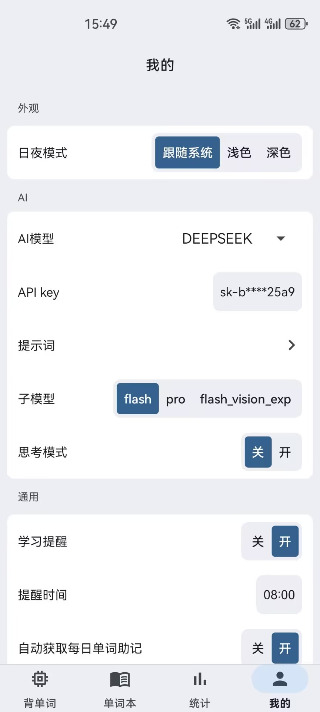

<p align="center">
  
</p>

<h1 align="center">Mnemo</h1>

<p align="center">一款结合 AI 智能助记与间隔重复复习算法的 Android 背单词应用。</p>

---

## 使用教程

### 1. 首次启动：导入词库

第一次打开需要等待应用导入词库（应用内置开源词库），导入完成后才能开始。

### 2. 设置学习内容

背单词页选择词汇本，加入学习计划，设置每日新学单词数量（默认 20 词/天）。

### 3. 配置 AI（可选，用于 AI 助记 / AI 对话）

在「我的 → 设置」中填入 DeepSeek API Key 并选择模型，目前仅支持 DeepSeek 服务，不配置 API Key 也能正常背单词，只是无法使用 AI 功能。

### 4. 发音

发音为在线语音需要联网，支持英式发音与美式发音，点击单词发音。

---

## 功能

### AI 智能助记

接入 DeepSeek API，为每个单词生成结构化助记内容并本地缓存， 默认提示词将生成：
- 核心意象：用一句有画面感的中文解释单词含义
- 词根词缀拆解：前缀、词根、后缀的形态与含义
- 梯度例句：2～3 个常用例句，自动高亮目标单词
- 高频短语：0～5 个常见搭配

系统提示词与自定义要求可编辑；支持每日自动生成，可开关。

### AI 对话

对单词或学习内容进行追问，支持多轮对话。目前仅支持 DeepSeek。

### 发音

英式、美式两种发音，可随时切换 支持背诵时自动发音

### 复习算法

内置自定义间隔重复（Spaced Repetition）算法：每个单词的复习时间并非固定，而是由它的**忘记次数、模糊次数、背诵耗时、累计背诵次数**共同动态决定——越难记的词安排得越早，掌握越好的词间隔越长。到期单词自动进入每日学习计划。

#### 基础间隔

复习次数对应基础间隔（天）：

```
复习次数  0   1   2   3   4   5   6   7+
间隔(天)  1   2   4   7  14  21  30  30
```

#### 困难度评估

每次学习结束时，综合三个维度计算困难度 `difficulty ∈ [0, 1]`：

| 维度 | 权重 | 计分规则 |
|---|---|---|
| 忘记次数 | 0.5 | 1次=0.6 / 2次=0.9 / ≥3次=1.0 |
| 模糊次数 | 0.3 | 1次=0.4 / 2次=0.7 / ≥3次=1.0 |
| 学习耗时 | 0.2 | ≤10s=0 / ≤30s=0.4 / ≤60s=0.7 / >60s=1.0 |

#### 间隔调整

```
调整系数 = 1.0 - difficulty × 0.8        // 0.2 ~ 1.0
下次间隔 = 基础间隔 × 调整系数             // 钳制在 [1, 180] 天
```

- 毫无困难（模糊/忘记均为 0）→ 按基础间隔原样推进
- 越困难 → 间隔越短，单词会更快再次出现

#### 背诵队列动态重排

在背单词页面，每个词可给出三种反馈：

| 反馈 | 行为 | 队列位置 |
|---|---|---|
| 🟢 认识 | 完成该词，写入统计与复习计划 | 移出队列 |
| 🟡 模糊 | 统计模糊次数，重新插入 | 队列 **60% ~ 100%** 区间随机位置 |
| 🔴 忘了 | 统计忘记次数，重新插入 | 队列 **30% ~ 60%** 区间随机位置 |

忘记/模糊的词在当前队列中更早再次出现，形成"当轮巩固 + 跨天复习"双重复习。

### 每日学习计划

每日自动编排：新学单词 + 今日到期复习单词， 新学单词数量可自定义（默认 20 词/天）。

### 学习统计

查看自定义时间范围内学习趋势，单词详情页可查看该单词的历史学习记录

### 学习提醒

每日学习提醒，需授权通知权限，可开关。

### 单词本管理

多本词书，支持创建、修改、删除，词书加入 / 退出学习，词书内搜索添加 / 移除单词

### 其它

全局单词搜索，深色 / 浅色 / 跟随系统主题

## 运行截图




---

## 快速开始

前置要求：

- Android Studio
- JDK 17
- Android SDK（minSdk 26，targetSdk 36）

### 下载内置词库（首次构建前执行）

应用的内置词库 `app/src/main/assets/vocabulary.db`（约 200MB）**不随仓库分发**（GitHub 单文件上限 100MB），需要先从本仓库的 **Releases** 下载：

1. 前往本仓库 [Releases](https://github.com/sdfkjak/Mnemo/releases) 页面
2. 下载最新的 `vocabulary.db`
3. 放入 `app/src/main/assets/vocabulary.db`

下载完成后即可正常构建运行。

（备选：也可自行从 [skywind3000/ECDICT](https://github.com/skywind3000/ECDICT) 的 Releases 下载 `ecdict.csv`，用仓库内脚本生成，脚本会自动建表并从 CSV 的 `tag` 字段生成中考/高考/四级/六级/考研/托福/GRE/雅思等预置词书分组：

```bash
python tools/csv_to_sqlite.py <CSV文件路径> app/src/main/assets/vocabulary.db
```

示例：`python tools/csv_to_sqlite.py ecdict.csv app/src/main/assets/vocabulary.db`）

步骤：

```bash
git clone https://github.com/sdfkjak/Mnemo.git

# 命令行构建调试包
./gradlew :app:assembleDebug

# 构建发布包
./gradlew :app:assembleRelease
```

---
