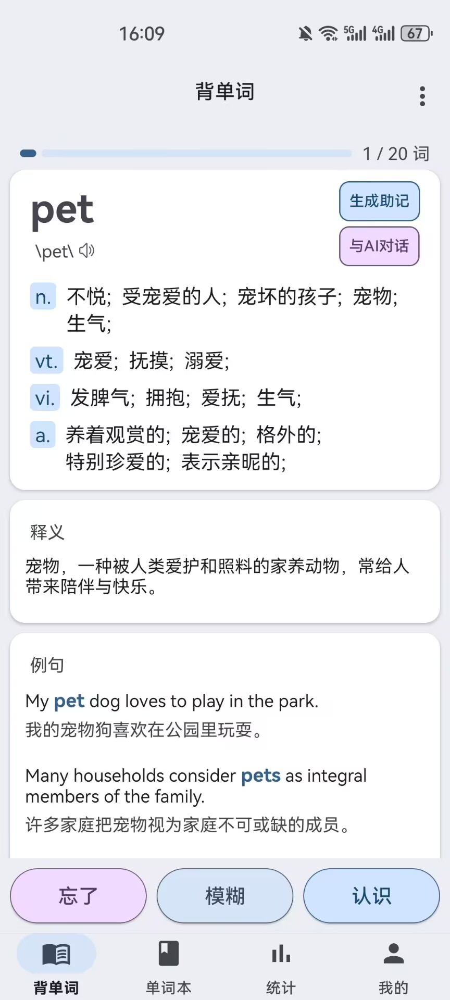
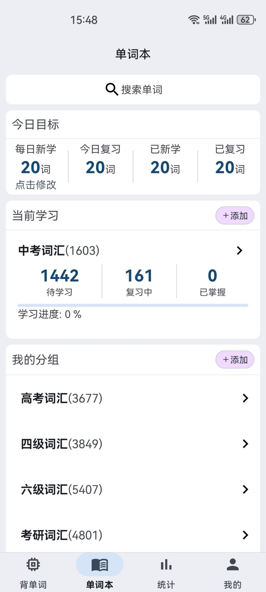
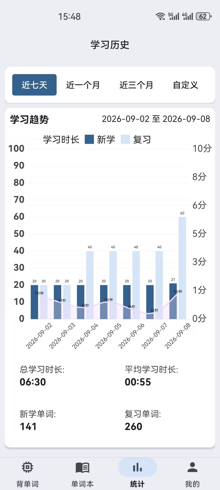

<p align="center">
  
</p>

<h1 align="center">Mnemo</h1>

<p align="center">一款 AI 助记 + 间隔重复复习的 Android 背单词应用<br/>
让AI为你解释单词，生成例句；复习算法自动安排单词复习日期。<br/>
内置约 77 万词离线词库，不联网也能学。</p>

<p align="center">
  <a href="LICENSE"></a>
  <a href="https://github.com/sdfkjak/Mnemo/releases"></a>
  <a href="https://developer.android.com"></a>
  <a href="https://kotlinlang.org"></a>
  <a href="https://github.com/sdfkjak/Mnemo/stargazers"></a>
  <a href="https://github.com/sdfkjak/Mnemo/issues"></a>
</p>

<p align="center">
  <a href="docs/recite.jpg"></a>
  <a href="docs/vocabulary.jpg"></a>
  <a href="docs/statistic.jpg"></a>
  <a href="docs/mine.jpg"></a>
</p>

## 目录

- [使用教程](#使用教程)
- [功能](#功能)
- [技术栈](#技术栈)
- [架构设计](#架构设计)
- [项目结构](#项目结构)
- [下载](#下载)
- [快速开始](#快速开始)
- [隐私说明](#隐私说明)
- [常见问题](#常见问题)
- [问题反馈](#问题反馈)
- [数据来源与致谢](#数据来源与致谢)
- [License](#license)

## 使用教程

### 1. 首次启动：导入词库
第一次打开需要等待应用导入词库（应用内置开源词库），导入完成后才能开始。
### 2. 设置学习内容
背单词页选择词汇本，加入学习计划，设置每日新学单词数量（默认 20 词/天）。
### 3. 配置 AI（可选，用于 AI 助记 / AI 对话）
在「我的 → 设置」中填入 DeepSeek API Key 并选择模型，目前仅支持 DeepSeek 服务，不配置 API Key 也能正常背单词，只是无法使用 AI 功能。
### 4. 发音
发音为在线语音需要联网，支持英式发音与美式发音，点击单词发音。

## 功能

### AI 智能助记

接入 DeepSeek API，为每个单词生成结构化助记内容并本地缓存，默认提示词将生成：
单词意象，词根词缀，例句，短语

系统提示词与自定义要求可编辑；支持每日自动生成，可开关。

### AI 对话

对单词或学习内容进行追问，支持多轮对话。目前仅支持 DeepSeek。

### 发音

英式、美式两种发音，可随时切换 支持背诵时自动发音

### 每日学习计划

每日自动编排：新学单词 + 今日到期复习单词， 新学单词数量可自定义（默认 20 词/天）。

### 学习统计

查看自定义时间范围内学习趋势，单词详情页可查看该单词的历史学习记录

### 学习提醒

每日学习提醒，需授权通知权限，可开关。

### 单词本管理

多本词书，支持创建、修改、删除，词书加入 / 退出学习，词书内搜索添加 / 移除单词

### 复习算法

内置自定义间隔重复（Spaced Repetition）算法：每个单词的复习时间并非固定，而是由它的**忘记次数、模糊次数、背诵耗时、累计背诵次数**共同动态决定——越难记的词安排得越早，掌握越好的词间隔越长。到期单词自动进入每日学习计划。

#### 基础间隔

复习次数对应基础间隔（天）：

```
复习次数  0   1   2   3   4   5   6   7+
间隔(天)  1   2   4   7  14  21  30  30
```

#### 困难度评估

每次学习结束时，综合三个维度计算困难度 `difficulty ∈ [0, 1]`：

| 维度 | 权重 | 计分规则 |
|---|---|---|
| 忘记次数 | 0.5 | 1次=0.6 / 2次=0.9 / ≥3次=1.0 |
| 模糊次数 | 0.3 | 1次=0.4 / 2次=0.7 / ≥3次=1.0 |
| 学习耗时 | 0.2 | ≤10s=0 / ≤30s=0.4 / ≤60s=0.7 / >60s=1.0 |

#### 间隔调整

```
调整系数 = 1.0 - difficulty × 0.8        // 0.2 ~ 1.0
下次间隔 = 基础间隔 × 调整系数             // 钳制在 [1, 180] 天
```

- 毫无困难（模糊/忘记均为 0）→ 按基础间隔原样推进
- 越困难 → 间隔越短，单词会更快再次出现

#### 背诵队列动态重排

在背单词页面，每个词可给出三种反馈：

| 反馈 | 行为 | 队列位置 |
|---|---|---|
| 🟢 认识 | 完成该词，写入统计与复习计划 | 移出队列 |
| 🟡 模糊 | 统计模糊次数，重新插入 | 队列 **60% ~ 100%** 区间随机位置 |
| 🔴 忘了 | 统计忘记次数，重新插入 | 队列 **30% ~ 60%** 区间随机位置 |

忘记/模糊的词在当前队列中更早再次出现，形成"当轮巩固 + 跨天复习"双重复习。

### 其它

全局单词搜索，深色 / 浅色 / 跟随系统主题

## 技术栈

| 分类 | 技术 |
|---|---|
| 语言 | Kotlin |
| UI | Android Views（XML + ViewBinding） |
| 架构 | 多模块 + MVVM（Hilt 依赖注入，Navigation 导航） |
| 本地存储 | Room（词库 / 学习记录）、Proto DataStore（用户设置） |
| 网络 | Retrofit + Gson（DeepSeek API） |
| 后台任务 | WorkManager（每日自动生成、学习提醒） |
| 音频 | Media3 / ExoPlayer（在线发音） |

## 架构设计

采用 **多模块 + MVVM + 单向依赖** 的分层架构（参考 Google Now in Android 的思路）：

```
app
 └─ feature/*                    页面（Fragment / ViewModel）
      ├─ core:domain             业务用例（UseCase）＋ 记忆算法
      │     └─ core:model        领域模型 + Repository 接口（零 Android 依赖）
      └─ core:data               仓库实现（RepositoryImpl），实现 model 的接口
             └─ core:database / core:network / core:datastore
```

**分层职责**

| 层 | 模块 | 职责 |
|---|---|---|
| 应用壳 | `app` | 入口、导航、主题 |
| 功能层 | `feature/*` | 各页面 Fragment / ViewModel / Adapter |
| 用例层 | `core:domain` | 业务用例（UseCase）+ 记忆算法 |
| 领域层 | `core:model` | 领域模型 + Repository 接口（零 Android 依赖） |
| 数据层 | `core:data` | Repository 实现、Entity ↔ Domain 映射 |
| 基础设施 | `core:database` / `core:network` / `core:datastore` / `core:notification` | Room、Retrofit、DataStore、通知 |

**关键设计原则**

- **Domain 隔离**：领域模型与用例零 Android 依赖，可独立测试
- **Repository 接口/实现分离**：接口定义在 `core:model`，实现在 `core:data`，经 `asExternalModel()` 转换
- **单向依赖**：feature 之间互不依赖，共享组件下沉到 `shared-ui`
- **响应式数据流**：DAO 返回 `Flow`，Repository 返回 `Flow<Result<T>>`，UI 只订阅、不主动拉取

**数据流**

```
Fragment / ViewModel
   → UseCase (core:domain)
   → Repository 接口 (core:model)
   → RepositoryImpl (core:data)
   → DAO / DataSource (core:database / core:network)
   → Flow<Result<T>> 返回 → UI 响应式刷新
```

## 项目结构

```
app/                          # 应用壳层（入口、导航、主题）
core/
  common/                     # 通用工具
  model/                      # 领域模型
  domain/                     # 业务用例
  database/                   # Room 数据库
  datastore/                  # 用户设置 DataStore
  datastore-proto/            # DataStore Protobuf 定义
  network/                    # DeepSeek 网络层
  data/                       # 数据仓库实现
  ui/                         # 通用 UI 组件
  notification/               # 通知
shared-ui/                    # 共享 UI 模块
feature/
  reciteword/                 # 背单词
  vocabularybook/             # 单词本
  vocabularybookgroup/        # 词书分组
  worddetail/                 # 单词详情
  search/                     # 搜索
  statistic/                  # 学习统计
  mine/                       # 我的 / 设置
  changevocabularybookword/   # 词书内增删单词
sync/                         # 同步
```

## 下载

前往本仓库 [Releases](https://github.com/sdfkjak/Mnemo/releases) 页面下载最新 APK 直接安装；也可以按下方「快速开始」自行构建。

## 快速开始

前置要求：

- Android Studio
- JDK 17
- Android SDK（minSdk 26，targetSdk 36）

### 下载内置词库（首次构建前执行）

应用的内置词库 `app/src/main/assets/vocabulary.db`（约 200MB）**不随仓库分发**（GitHub 单文件上限 100MB），需要先从本仓库的 **Releases** 下载：

1. 前往本仓库 [Releases](https://github.com/sdfkjak/Mnemo/releases) 页面
2. 下载最新的 `vocabulary.db`
3. 放入 `app/src/main/assets/vocabulary.db`

下载完成后即可正常构建运行。

备选：也可自行从 [skywind3000/ECDICT](https://github.com/skywind3000/ECDICT) 的 Releases 下载 `ecdict.csv`，用仓库内脚本生成，脚本会自动建表并从 CSV 的 `tag` 字段生成中考/高考/四级/六级/考研/托福/GRE/雅思等预置词书分组：

```bash
python tools/csv_to_sqlite.py <CSV文件路径> app/src/main/assets/vocabulary.db
```

示例：`python tools/csv_to_sqlite.py ecdict.csv app/src/main/assets/vocabulary.db`

步骤：

```bash
git clone https://github.com/sdfkjak/Mnemo.git

# 命令行构建调试包
./gradlew :app:assembleDebug

# 构建发布包
./gradlew :app:assembleRelease
```

## 隐私说明

- **API Key 只保存在设备本地**：通过 Proto DataStore 存储在应用私有目录，不上传到任何第三方服务器；仅在调用 DeepSeek 官方 API（`api.deepseek.com`）时随请求发送。
- **学习数据本地存储**：词库、学习记录、统计、AI 助记缓存等均保存在设备本地。
- **联网行为**：仅在使用 AI 助记 / AI 对话（DeepSeek API）和在线发音时需要联网；内置词库导入无需联网。
- **无账号与追踪**：应用没有账号体系，未接入任何第三方统计 / 广告 SDK，不采集个人数据。

## 常见问题

**Q：为什么词库不随仓库一起分发？**
内置词库约 200MB，超过 GitHub 单文件 100MB 上限，需从 Releases 单独下载。

**Q：不配置 API Key 能用吗？**
可以。背单词、复习、统计等核心功能均可用，仅 AI 助记 / AI 对话 / 每日自动生成不可用。

**Q：API Key 安全吗？**
安全。Key 只保存在设备本地，直接请求 DeepSeek 官方 API，不会经过或上传到任何第三方服务器。

**Q：发音为什么需要联网？**
发音使用在线语音，需要网络连接。

**Q：支持哪些词书？**
内置中考 / 高考 / 四级 / 六级 / 考研 / 托福 / GRE / 雅思等预置词书，也可自行创建、修改自定义词书。

## 问题反馈

使用过程中遇到 Bug 或有功能建议，欢迎到 [Issues](https://github.com/sdfkjak/Mnemo/issues) 提交。

## 数据来源与致谢

- 词库数据：[skywind3000/ECDICT](https://github.com/skywind3000/ECDICT)
- AI 能力：[DeepSeek](https://www.deepseek.com/)
- 发音来源：有道词典在线发音接口（非官方，仅供学习使用，音频版权归原平台所有）

## License

本项目采用 [MIT License](LICENSE)。
