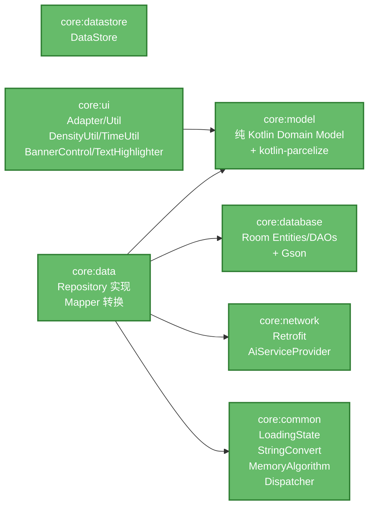
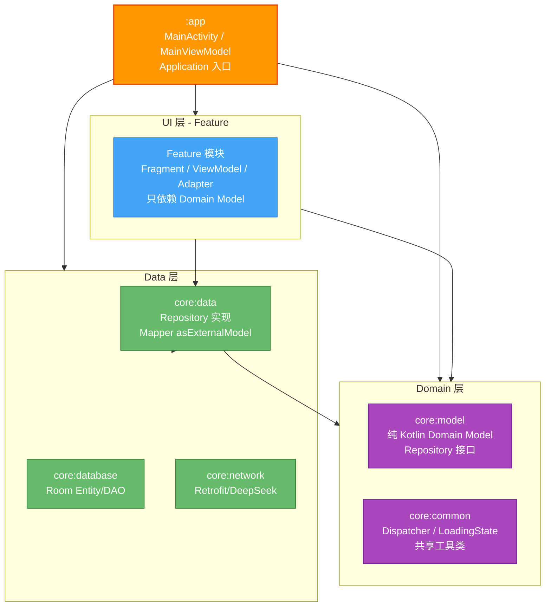

# MnemoAI 模块依赖关系图

## 一、完整依赖关系图

```mermaid
graph TD
    %% 应用入口
    APP[:app]

    %% Feature 模块
    subgraph Feature[Feature 模块层]
        VB[feature:vocabularybook]
        VBG[feature:vocabularybookgroup]
        CVBW[feature:changevocabularybookword]
        SEARCH[feature:search]
        RECITE[feature:reciteword]
        WD[feature:worddetail]
        MINE[feature:mine]
        STAT[feature:statistic]
    end

    %% Shared 模块
    SHARED_UI[shared-ui]

    %% Core 模块
    subgraph Core[Core 模块层]
        UI[core:ui]
        DATA[core:data]
        DATABASE[core:database]
        NETWORK[core:network]
        MODEL[core:model]
        COMMON[core:common]
        DATASTORE[core:datastore]
    end

    %% app 依赖所有 feature 和 core
    APP --> VB
    APP --> VBG
    APP --> CVBW
    APP --> SEARCH
    APP --> RECITE
    APP --> WD
    APP --> MINE
    APP --> STAT
    APP --> SHARED_UI
    APP --> UI
    APP --> DATA
    APP --> DATABASE
    APP --> NETWORK
    APP --> MODEL
    APP --> COMMON
    APP --> DATASTORE

    %% feature 间依赖（唯一的 feature→feature 依赖）
    VBG --> CVBW

    %% feature → core 依赖
    VB --> MODEL
    VB --> DATA
    VB --> DATABASE
    VB --> UI
    VB --> COMMON

    VBG --> DATABASE
    VBG --> DATA
    VBG --> MODEL
    VBG --> UI
    VBG --> COMMON

    CVBW --> DATABASE
    CVBW --> DATA
    CVBW --> MODEL
    CVBW --> UI
    CVBW --> COMMON

    SEARCH --> MODEL
    SEARCH --> DATA
    SEARCH --> UI
    SEARCH --> COMMON

    RECITE --> MODEL
    RECITE --> DATABASE
    RECITE --> DATA
    RECITE --> UI
    RECITE --> COMMON

    WD --> MODEL
    WD --> DATABASE
    WD --> DATA
    WD --> UI
    WD --> COMMON

    MINE --> MODEL
    MINE --> DATA
    MINE --> UI
    MINE --> COMMON

    STAT --> DATABASE
    STAT --> DATA
    STAT --> MODEL
    STAT --> UI
    STAT --> COMMON

    %% core → core 依赖
    DATA --> MODEL
    DATA --> DATABASE
    DATA --> NETWORK
    DATA --> COMMON
    UI --> MODEL

    %% 样式
    classDef app fill:#ff9800,stroke:#e65100,color:#fff,stroke-width:2px
    classDef feature fill:#42a5f5,stroke:#1565c0,color:#fff
    classDef core fill:#66bb6a,stroke:#2e7d32,color:#fff
    classDef shared fill:#ab47bc,stroke:#6a1b9a,color:#fff

    class APP app
    class VB,VBG,CVBW,SEARCH,RECITE,WD,MINE,STAT feature
    class UI,DATA,DATABASE,NETWORK,MODEL,COMMON,DATASTORE core
    class SHARED_UI shared
```



## 二、Core 模块依赖关系（放大视图）



## 三、架构分层依赖规则



## 四、各 Feature 模块依赖详情

| Feature 模块 | core:model | core:data | core:database | core:ui | core:common | feature 间 |
|---|:---:|:---:|:---:|:---:|:---:|:---:|
| feature:search | ✓ | ✓ | - | ✓ | ✓ | - |
| feature:mine | ✓ | ✓ | - | ✓ | ✓ | - |
| feature:statistic | ✓ | ✓ | ✓ | ✓ | ✓ | - |
| feature:reciteword | ✓ | ✓ | ✓ | ✓ | ✓ | - |
| feature:worddetail | ✓ | ✓ | ✓ | ✓ | ✓ | - |
| feature:changevocabularybookword | ✓ | ✓ | ✓ | ✓ | ✓ | - |
| feature:vocabularybook | ✓ | ✓ | ✓ | ✓ | ✓ | - |
| feature:vocabularybookgroup | ✓ | ✓ | ✓ | ✓ | ✓ | → changevocabularybookword |

## 五、关键架构原则

### 依赖方向（严格单向）

```
app → feature → core:data → core:database / core:network
                 ↓
              core:model / core:common
```

### 解耦要点

1. **feature 层不直接依赖 core:database**
   - 仅 feature:vocabularybookgroup / changevocabularybookword / statistic 等历史遗留模块暂保留 database 依赖
   - feature:vocabularybook 已完全迁移为依赖 core:model 的 Domain Model

2. **core:data 不依赖任何 feature/ui**
   - Repository 通过 `asExternalModel()` 将 database Entity 转换为 Domain Model
   - LoadingState、ReciteStatistics 已迁移至 core:model / core:common

3. **core:model 零 Android 依赖**
   - 纯 Kotlin 类，仅依赖 `kotlin-parcelize`
   - 所有 Domain Model 定义在此（Group / WordItem / ReciteStatistics 等）

4. **core:common 存放跨层共享的工具**
   - `LoadingState`（替代旧 `ui.model.LoadingState`）
   - `StringConvert` / `MemoryAlgorithm`（替代旧 `utils.*`）
   - `Dispatcher` / `MaiDispatcher`（Hilt 限定符）
